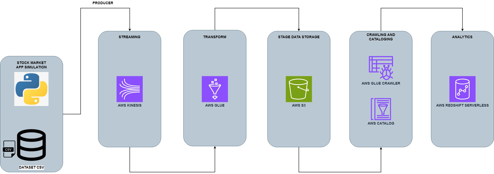

# Stock_Market_Real_Time
## Steps

#### SCRIPT Aws_Stock_Market_Real_Time
        - Send data reading from indexProcessed.csv to Azure EventHub
        - name -> Aws_Stock_Market_Real_Time.ipynb 

#### AWS KINESIS:
###### Configuration
        - name -> stock_market_real_time_kinesis_data_stream
        - capacity mode -> On-demand
        - all conifiguration -> default

#### AWS GLUE
###### DATA SOURCE PROPERTIES
        - name -> kinesis stream
        - amazon kinesis source -> stream details
        - location of data stream -> stream is located in my account
        - region -> us-east-2
        - stream name -> stock_market_real_time_kinesis_data_stream
        - data format -> json
        - all conifiguration -> default

###### DATA TARGET PROPERTIES
        - name -> amazon s3

## Architecture-Diagram
