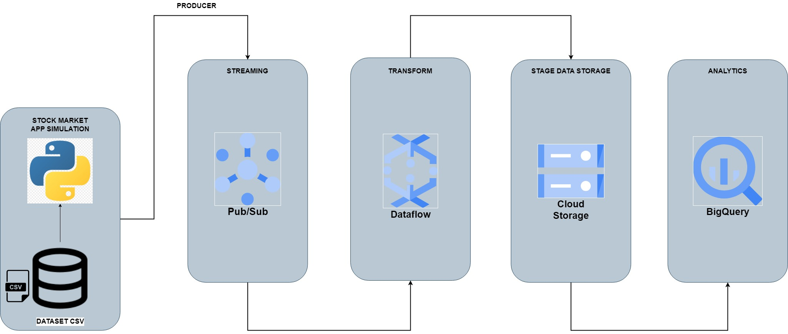

# Stock_Market_Real_Time
## Steps

#### SCRIPT GCP_Stock_Market_Real_Time
        - Send data reading from indexProcessed.csv to GCP Pub/Sub
        - name -> GCP_Stock_Market_Real_Time.ipynb 

#### GCP PUB SUB:
###### Details
        - topic -> stock_market_real_time_pub_sub
        - subscription -> stock_market_real_time_pub_sub
        - delivery type -> pull
        - all configuration -> default

#### GCP DATAFLOW WORKBENCH
        - script -> stock_market_real_time_dataflow.py

#### STAGE ZONE STORAGE
        - google storage -> YOUR STAGE ZONE STORAGE
        - storage clase -> standar
        - object -> stock_market_real_time

#### GCP BIGQUERY
###### DB
        name -> stock_market_real_time_db

###### DATASET TBL_ATHLETES
    - Id table -> YOUR SERVICE ACCOUNT/stock_market_real_time_db.tbl_stock_market_real_time
    - External storage
        - uri source -> gs://YOUR DATA STAGE ZONE/stock_market_real_time/
    - Format -> CSV
    - Detection schema -> true
    - Tag -> YOUR SERVICE ACCOUNT/stock_market_real_time_tag:stock_market_real_time_tag

## Architecture-Diagram
